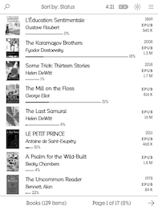

*Plato* is a document reader for *Kobo*'s e-readers, created by [Bastien Dejean](https://github.com/baskerville)

This fork by me contains changes and additional features you may find useful, including:

- Themes, CSS tweaking.
- Google translate and wikipedia search.
- Page scrubber.
- Updated library view.
- Progress bar
- lots more.

  

## Installation

If you already have Plato installed, simply download latest release [here](https://github.com/thataboy/plato/releases) then extract the entire zip file's content into where Plato is installed, usually `./adds/plato`, overwriting everything (your settings will be preserved).

If this is your first time installing Plato, the easiest way is to get the
[Plato one-click install package from mobileread.com](https://www.mobileread.com/forums/showthread.php?t=314220). After installing that, do the step above to install my version of Plato.

## Documentation

Read the [full install and set up guide](doc/GUIDE.md) and [user manual](doc/MANUAL.md).

Read the [build guide](doc/BUILD.md) if you want to build the app yourself.

## Supported firmwares

Any 4.*X*.*Y* firmware, with *X* ≥ 6, will do.

## Supported devices

- *Elipsa 2E*.
- *Clara 2E*.
- *Libra 2*.
- *Sage*.
- *Elipsa*.
- *Nia*.
- *Libra H₂O*.
- *Forma*.
- *Clara HD*.
- *Aura H₂O Edition 2*.
- *Aura Edition 2*.
- *Aura ONE*.
- *Glo HD*.
- *Aura H₂O*.
- *Aura*.
- *Glo*.
- *Touch C*.
- *Touch B*.

## Supported formats

- PDF, CBZ, FB2, MOBI and XPS via [MuPDF](https://mupdf.com/index.html).
- ePUB through a built-in renderer.
- DJVU via [DjVuLibre](http://djvu.sourceforge.net/index.html).

## Features

- Crop the margins.
- Continuous fit-to-width zoom mode with line preserving cuts.
- Rotate the screen (portrait ↔ landscape).
- Adjust the contrast.
- Define words using *dictd* dictionaries.
- Annotations, highlights and bookmarks.
- Retrieve articles from online sources through [hooks](doc/HOOKS.md) (an example *wallabag* [article fetcher](doc/ARTICLE_FETCHER.md) is provided).

   

## Donations

